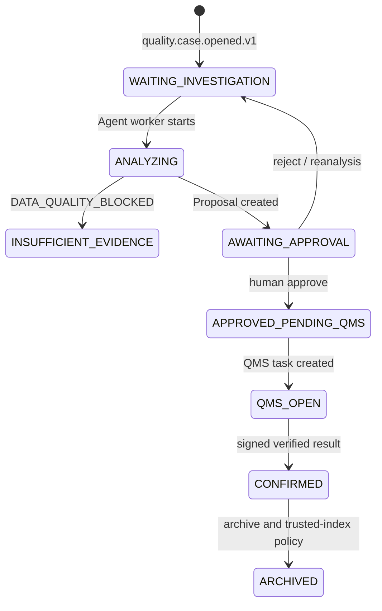

# Quality Case 状态机

```mermaid
stateDiagram-v2
  [*] --> WAITING_INVESTIGATION: quality.case.opened.v1
  WAITING_INVESTIGATION --> ANALYZING: Agent worker starts
  ANALYZING --> INSUFFICIENT_EVIDENCE: DATA_QUALITY_BLOCKED
  ANALYZING --> AWAITING_APPROVAL: Proposal created
  AWAITING_APPROVAL --> WAITING_INVESTIGATION: reject / reanalysis
  AWAITING_APPROVAL --> APPROVED_PENDING_QMS: human approve
  APPROVED_PENDING_QMS --> QMS_OPEN: QMS task created
  QMS_OPEN --> CONFIRMED: signed verified result
  CONFIRMED --> ARCHIVED: archive and trusted-index policy
```
