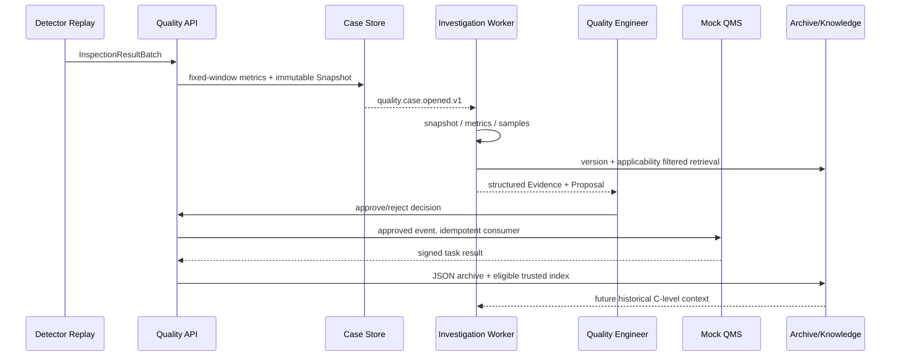

# 主链路时序图

```mermaid
sequenceDiagram
  participant Detector as Detector Replay
  participant API as Quality API
  participant Case as Case Store
  participant Agent as Investigation Worker
  participant Human as Quality Engineer
  participant QMS as Mock QMS
  participant Archive as Archive/Knowledge

  Detector->>API: InspectionResultBatch
  API->>Case: fixed-window metrics + immutable Snapshot
  Case-->>Agent: quality.case.opened.v1
  Agent->>Agent: snapshot / metrics / samples
  Agent->>Archive: version + applicability filtered retrieval
  Agent-->>Human: structured Evidence + Proposal
  Human->>API: approve/reject decision
  API->>QMS: approved event, idempotent consumer
  QMS-->>API: signed task result
  API->>Archive: JSON archive + eligible trusted index
  Archive-->>Agent: future historical C-level context
```
