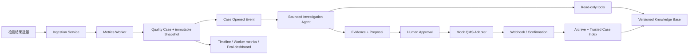

# 系统架构总览

```mermaid
flowchart LR
  D[检测结果批量] --> I[Ingestion Service]
  I --> M[Metrics Worker]
  M --> C[Quality Case + immutable Snapshot]
  C --> O[Case Opened Event]
  O --> A[Bounded Investigation Agent]
  A --> T[Read-only tools]
  T --> K[Versioned Knowledge Base]
  A --> P[Evidence + Proposal]
  P --> H[Human Approval]
  H --> Q[Mock QMS Adapter]
  Q --> W[Webhook / Confirmation]
  W --> R[Archive + Trusted Case Index]
  R --> K
  C --> X[Timeline / Worker metrics / Eval dashboard]
```

当前仓库使用确定性内存 Adapter 作为离线验收实现；PostgreSQL、Redis Streams、MinIO 和真实模型均通过 Port 保留替换边界，Docker Compose 提供 API/Web 的可启动作品集环境。
