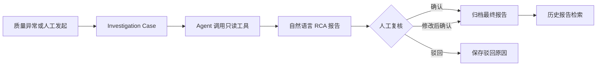

# Quality Investigation Copilot 简化重构开发计划

版本：2.0  
状态：拟实施  
日期：2026-08-25  

## 1. 文档目的

本文定义 Quality Case Investigation Agent 从“结构化证据与 QMS 闭环演示”重构为“自然语言 RCA 调查 Copilot”的完整开发流程。

本计划是后续重构的主执行依据。已有文档继续作为历史设计和既有能力说明，不再作为新产品主线的范围约束：

- `quality_case_agent_development_plan.md`：Phase 00–15 的历史开发计划；
- `quality_case_agent_optimization_roadmap.md`：Phase 16–22 的生产化扩展路线；
- 本文：简化产品后的重构、替换和发布顺序。

本计划解决三个问题：

1. 用户输出过度结构化，阅读体验像内部契约展示；
2. Proposal、审批、QMS、Delivery、Webhook 组成的业务闭环超过当前产品需要；
3. Agent 工具数量少，真实模型尚未形成完整的“调用工具—读取结果—继续调查”循环。

---

## 2. 产品定位冻结

### 2.1 一句话定位

> 当质量异常发生后，Agent 使用只读工具调查质量指标、样本、数据库、日志、设备状态、变更记录和企业知识，生成自然语言 RCA 与修复建议，由工程师确认或修改后归档保存。

### 2.2 目标用户

- 质量工程师；
- 视觉算法工程师；
- 设备工程师；
- 制造现场问题负责人；
- 需要复盘历史异常的技术管理者。

### 2.3 核心用户价值

- 减少人工在多个系统中查找信息的时间；
- 将调查过程和来源集中到一份可读报告；
- 明确区分已观察事实、可能原因和仍未确认的信息；
- 允许工程师修正 Agent 结论；
- 将最终确认的报告保存为可检索历史经验。

### 2.4 MVP 必须具备

- 从现有 Quality Case 或人工请求启动调查；
- Agent 能连续调用多个只读工具，并在下一轮看到每次工具结果；
- 输出自然语言 RCA、关键依据、修复建议和未确认事项；
- 人工可以确认、编辑后确认或驳回；
- 保存原始报告、人工最终版本、来源引用和版本信息；
- 历史报告可以列表、查看和检索；
- 离线确定性模式和一个真实 LLM 模式均可运行；
- 固定场景 Eval 能阻止无依据结论和危险工具调用。

### 2.5 明确不做

- Agent 不直接控制 PLC、相机、夹具、分拣机构或生产参数；
- Agent 不执行任意 Shell、Python 或写 SQL；
- MVP 不接真实 QMS/MES 写入；
- 不模拟完整 QMS Task、Delivery、Webhook、DLQ 和补偿流程；
- 不把用户界面做成 Evidence ID、Hypothesis ID 和 Proposal 状态机展示页；
- 不要求 Agent 自动确认唯一根因；
- 不为尚无实现的每一种外部系统创建独立空 Port；
- 不把聊天会话作为核心业务实体。

### 2.6 产品成功标准

MVP 发布时必须同时满足：

- 用户可以在一个页面完成“查看异常—阅读报告—修改/确认—归档”；
- 真实 LLM 能读取工具 schema，并能基于上一轮工具结果决定下一步；
- 报告不向用户暴露内部 Evidence/Hypothesis/Proposal 契约；
- 所有事实性结论能回溯到至少一个来源引用；
- 证据不足时报告明确说明未确认事项，不编造测量值；
- Agent 没有生产写权限；
- 核心 Eval 和软件测试全部通过。

---

## 3. 目标业务流程



### 3.1 状态模型

主状态只保留：

```text
OPEN -> INVESTIGATING -> REVIEW -> ARCHIVED
                    \-> FAILED
REVIEW -> REJECTED
```

状态含义：

| 状态 | 含义 |
| --- | --- |
| `OPEN` | Case 已创建，尚未开始调查 |
| `INVESTIGATING` | Agent 正在调用工具和生成报告 |
| `REVIEW` | 报告已生成，等待人工确认 |
| `ARCHIVED` | 人工确认或修改后确认，最终版本已保存 |
| `REJECTED` | 人工认为报告不可用，记录原因但不进入可信历史结果 |
| `FAILED` | 模型、工具或系统错误导致调查未完成 |

### 3.2 人工决策

只保留三种决策：

- `CONFIRMED`：确认 Agent 原始报告；
- `CONFIRMED_WITH_EDITS`：人工修改后确认；
- `REJECTED`：驳回并记录原因。

QMS 写入不属于主状态机。未来如需接入，作为归档后的可选 Destination Adapter 实现。

---

## 4. 目标输出

### 4.1 用户可见报告

默认输出为 Markdown 自然语言，固定使用少量可读章节，不展示内部契约：

```markdown
## 初步判断

本次 NG 率升高更可能与夹具定位偏移有关，但目前不能确认定位销磨损是唯一原因。

## 关键依据

异常主要集中在工件右上区域，并且最近三个统计窗口持续扩大。异常前进行过一次换线，时间上存在关联。

## 建议处理

先使用基准件复测定位偏移量，然后检查定位销间隙。如果复测正常，再检查相机位置和曝光参数。

## 尚未确认

目前缺少定位销间隙测量值和换线后的首件确认记录。
```

报告末尾可以展示简短来源：

```text
调查来源：质量指标窗口、代表性样本、换线记录、夹具维护手册 v4
```

### 4.2 内部最小契约

自然语言输出不等于无结构。外部 interface 返回一个小型信封：

```python
class InvestigationReport:
    report_id: str
    case_id: str
    status: Literal["COMPLETED", "INCONCLUSIVE", "FAILED"]
    content_markdown: str
    source_refs: list[SourceRef]
    created_at: datetime
    model_version: str
    prompt_version: str
    toolset_version: str
```

`SourceRef` 只保存归档和追溯需要的信息：

```python
class SourceRef:
    source_id: str
    source_type: str
    title: str
    reference: str
    collected_at: datetime | None
```

### 4.3 输出规则

- 不向用户显示 `EV-A-001`、`H-01`、`ProposalContract` 等内部标识；
- 不输出伪精确置信度，例如 `86%`，除非完成了校准；
- 使用“更可能”“存在关联”“尚不能确认”等自然语言表达不确定性；
- 每个关键事实必须能对应 `source_refs` 中的来源；
- 历史案例必须表述为“类似案例”或“历史经验”，不能写成当前根因证明；
- 建议必须是人工可执行的检查步骤，不得成为设备控制指令；
- 数据不足时允许生成 `INCONCLUSIVE` 报告。

---

## 5. 目标模块与 Interface

新主线只暴露三个主要 interface。Planner、上下文管理、引用校验、模型适配和工具编排属于内部 seam。

### 5.1 InvestigationModule

```python
class InvestigationModule:
    def investigate(self, request: InvestigationRequest) -> InvestigationReport: ...
```

职责：

- 加载 Case 和 Snapshot；
- 获取当前可用工具定义；
- 执行有界 Agent Loop；
- 把每次工具结果加入后续模型上下文；
- 控制时间、轮次、token、成本和失败预算；
- 生成自然语言报告；
- 校验报告引用和禁止性规则；
- 保存运行 Trace 和版本信息。

内部可由 Planner、Context Manager、Report Writer 和 Citation Validator 组成，但调用方和测试不跨过 `investigate()` interface。

### 5.2 ToolRuntime

```python
class ToolRuntime:
    def available_tools(self, scope: ToolScope) -> tuple[ToolDefinition, ...]: ...
    def invoke(self, call: ToolCall) -> ToolResult: ...
```

`ToolDefinition`：

```python
class ToolDefinition:
    name: str
    description: str
    input_schema: dict[str, object]
    output_schema: dict[str, object]
    read_only: bool
    timeout_seconds: float
    max_output_bytes: int
```

`ToolResult`：

```python
class ToolResult:
    tool_call_id: str
    tool_name: str
    status: Literal["SUCCESS", "ERROR"]
    summary: str
    payload: dict[str, object] | None
    payload_ref: str | None
    source_refs: list[SourceRef]
    duration_ms: int
    error_category: str | None
```

不变量：

- 只有已装配且健康的 Adapter 才能出现在 `available_tools()`；
- 未实现的预留工具不得暴露给模型；
- 所有工具默认只读；
- 参数必须按 JSON Schema 校验；
- 工具结果必须经过大小控制；
- 工具错误作为可审计结果返回，不把 Secret 和连接信息发送给模型；
- 不为每个工具建立一层只做转发的浅模块。

### 5.3 ReviewArchiveModule

```python
class ReviewArchiveModule:
    def review(self, command: ReviewCommand) -> ArchivedInvestigation: ...
```

职责：

- 校验报告当前状态；
- 保存人工原始决策；
- 保存编辑后的最终 Markdown；
- 保存操作者、时间和备注；
- 生成不可变归档记录；
- 决定是否进入可信历史报告检索。

### 5.4 外部依赖 Seam

只有存在生产 Adapter 和测试 Adapter 时才建立独立 seam。MVP 保留：

- `LLMClient`：真实模型 Adapter + 确定性测试 Adapter；
- `ReportStore`：PostgreSQL Adapter + InMemory Adapter；
- `ObjectStore`：MinIO Adapter + InMemory Adapter；
- `InvestigationTool`：多个工具 Adapter 共用的统一 interface。

未来数据库、日志、设备和 QMS 接入通过 `InvestigationTool` 或 Destination Adapter 扩展，不提前创建大量空 Port。

---

## 6. 目标包结构

计划结构如下，具体落地时允许在不扩大 interface 的前提下调整文件名：

```text
backend/src/quality_case_agent/
├── contracts/
│   ├── investigation_report.py
│   ├── review.py
│   └── tools.py
├── domain/
│   └── investigation/
│       ├── models.py
│       └── state.py
├── application/
│   ├── investigation/
│   │   ├── module.py
│   │   ├── agent_loop.py
│   │   ├── context.py
│   │   ├── report_writer.py
│   │   ├── citation_validator.py
│   │   └── tool_runtime.py
│   ├── review_archive/
│   │   └── module.py
│   └── ports/
│       ├── llm.py
│       ├── investigation_tools.py
│       ├── reports.py
│       └── object_store.py
├── adapters/
│   ├── llm/
│   ├── tools/
│   │   ├── case_snapshot.py
│   │   ├── quality_metrics.py
│   │   ├── representative_samples.py
│   │   ├── knowledge_search.py
│   │   ├── database_read.py
│   │   ├── log_search.py
│   │   ├── equipment_state.py
│   │   └── change_history.py
│   ├── postgres/
│   └── minio/
└── entrypoints/
    ├── api/
    └── workers/
```

`application/investigation` 对外仍是一个深模块。内部文件拆分不等于增加外部 interface。

---

## 7. 数据模型

### 7.1 核心实体

MVP 只要求四类持久化记录：

| 记录 | 用途 |
| --- | --- |
| `InvestigationCase` | 调查入口、Snapshot 引用和当前状态 |
| `InvestigationReport` | Agent 生成的原始自然语言报告 |
| `ReviewRecord` | 人工确认、编辑或驳回记录 |
| `ArchivedInvestigation` | 最终不可变归档和可信历史检索来源 |

### 7.2 InvestigationCase

建议字段：

```text
case_id
source_type
source_ref
snapshot_ref
title
status
opened_at
updated_at
current_report_id
```

### 7.3 ReviewRecord

建议字段：

```text
review_id
report_id
case_id
decision
reviewer_id
original_content_sha256
final_content_markdown
final_content_sha256
comment
reviewed_at
```

### 7.4 ArchivedInvestigation

建议字段：

```text
archive_id
case_id
report_id
review_id
snapshot_ref
final_content_markdown
source_refs
model_version
prompt_version
toolset_version
archived_at
trusted_for_retrieval
```

### 7.5 迁移原则

- 现有 Case 和 Snapshot 数据继续使用；
- 已生成 Proposal/QMS 演示数据不强制迁移为新报告；
- 新旧契约短期并存时，写入只走新模型，旧接口只读；
- 完成 WebUI 切换后删除旧 Proposal 主流程；
- 历史演示脚本保留在兼容目录或 Git 历史中，不进入新主路径。

---

## 8. 通用开发流程规定

每个 Phase 必须按相同顺序执行，禁止先堆实现再补验收。

### 8.1 Phase 开始条件

开始编码前必须具备：

1. 本 Phase 的目标和不做事项；
2. 一个可以演示的用户路径；
3. interface 或外部契约草案；
4. 至少一个成功场景和一个失败/拒答场景；
5. 数据库迁移和兼容性判断；
6. 可执行验收标准。

### 8.2 Phase 实施顺序

```text
场景与验收冻结
-> interface/契约测试
-> 最小实现
-> Adapter 集成测试
-> 垂直路径测试
-> WebUI 或演示脚本
-> Eval/性能/安全检查
-> 文档与开发日志
-> Phase Gate
```

### 8.3 每个 Phase 的 Definition of Done

- 新增行为有自动化测试；
- 旧行为被替换时删除过时测试，不叠加测试内部实现的脆弱断言；
- Ruff、mypy、pytest 通过；
- 有 WebUI 变更时 Playwright 关键流通过；
- 外部契约变更有 Schema 和示例；
- 新工具有参数错误、超时和超限结果测试；
- 日志和 Trace 不包含 Secret、原始 Prompt 或私有文档全文；
- 开发日志记录已知限制和回滚方式；
- 阶段验收命令与实际结果被记录；
- 未完成项不会在 README 中宣传为已实现。

### 8.4 提交规定

- 一个提交只解决一个可描述问题；
- 先提交契约和测试，再提交实现时应保持每个提交可运行；
- 协议或迁移变化使用明确 scope；
- 不在重构提交中混入格式化全仓库或无关 UI 改动；
- 删除旧模块必须单独提交，便于回滚；
- 每个 Phase 结束后形成一个可标记的里程碑提交。

### 8.5 质量门禁

任何 Phase 不能只以“代码已写完”为完成条件。至少检查：

- 功能正确性；
- interface 行为；
- 失败和超时；
- 权限与只读约束；
- 数据兼容性；
- 可观测性；
- 用户路径；
- 回滚能力。

---

## 9. Phase 总览

| Phase | 名称 | 核心结果 | 依赖 |
| --- | --- | --- | --- |
| 0 | 重构基线与迁移护栏 | 冻结旧链路基线，建立新旧切换方式 | 当前 master |
| 1 | 自然语言 Investigation Report | 用户看到简洁 RCA 报告 | Phase 0 |
| 2 | 简化人工复核与归档 | 替换 Proposal/QMS 主闭环 | Phase 1 |
| 3 | Tool Runtime v2 | 真实模型能理解工具 schema 和结果 | Phase 1 |
| 4 | 调查工具目录与预留接口 | 扩展数据库、日志、设备等工具能力 | Phase 3 |
| 5 | 上下文预算与安全控制 | 大结果、超时、注入和成本受控 | Phase 3–4 |
| 6 | 真实 LLM 调查闭环 | DeepSeek 等模型完成真实多轮调查 | Phase 3–5 |
| 7 | Eval、可观测性与发布门禁 | 能量化判断版本是否可发布 | Phase 2、6 |
| 8 | 简化 WebUI、删除旧主链与 MVP 发布 | 新产品路径成为唯一默认路径 | Phase 2、7 |

---

## 10. Phase 0：重构基线与迁移护栏

### 10.1 目标

在不破坏现有 Demo 的前提下，冻结旧行为、确定删除范围，并为新主线建立可回滚入口。

### 10.2 实现内容

- 记录当前后端、前端和演示脚本测试结果；
- 保存三条基准场景：夹具偏移、光照漂移、证据不足；
- 为旧输出保存 Golden JSON/页面截图；
- 增加新流程 Feature Flag，例如 `QUALITY_EXPERIENCE_MODE=copilot|legacy`；
- 新增重构迁移清单，标明保留、替换、可选和删除模块；
- 禁止在本 Phase 修改核心业务语义。

### 10.3 模块处理清单

| 当前模块 | 决定 |
| --- | --- |
| Ingestion、Metrics、Case Detection、Snapshot | 保留 |
| Investigation Agent Loop | 重构后保留 |
| Planner、Synthesizer、Grounding、Policy | 收入 InvestigationModule 内部 |
| Proposal、Approval | 由 ReviewArchiveModule 替换 |
| QMS、Delivery、Webhook | 移出 MVP 主流程，保留为可选示例直到 Phase 8 |
| Knowledge、Archive | 简化并保留 |
| Eventing、Persistence、Observability | 保留，按新流程重新接线 |
| ROI Dashboard | 移出 MVP 默认导航 |

### 10.4 测试

- 全量现有后端测试；
- 现有 Playwright 关键路径；
- 三个固定场景输出指纹；
- Feature Flag 默认仍走旧路径。

### 10.5 阶段门禁

- 当前测试全部通过；
- 新旧范围表经过确认；
- 可以一条配置切回 legacy；
- 没有删除数据库表和历史数据；
- 完成 Phase 0 开发日志。

### 10.6 不做事项

- 不修改最终报告格式；
- 不删除 QMS 代码；
- 不增加新工具；
- 不接真实数据库查询工具。

---

## 11. Phase 1：自然语言 Investigation Report

### 11.1 目标

将用户输出从 Evidence/Hypothesis/Proposal 契约展示改为自然语言 RCA 报告，同时保留最小来源追溯信息。

### 11.2 实现内容

- 新增 `InvestigationReportContract` 和 `SourceRefContract`；
- 新增 Report Writer，将调查上下文生成 Markdown；
- 新增 Citation Validator，校验报告引用只来自本次工具结果；
- 支持 `COMPLETED`、`INCONCLUSIVE`、`FAILED`；
- 保留旧输出只读兼容转换，不允许新代码继续依赖旧 Proposal；
- 新增报告获取入口；
- WebUI 先增加实验性报告详情，不删除旧页面。

### 11.3 报告最低内容

- 初步判断；
- 关键依据；
- 建议处理；
- 尚未确认；
- 调查来源。

允许某一节为空，但不能用虚构内容填充。

### 11.4 测试

- 完整报告契约测试；
- 无依据数字禁止出现在报告；
- 历史案例不能写成当前根因事实；
- 数据不足生成 `INCONCLUSIVE`；
- Markdown 中不存在内部 Evidence/Hypothesis/Proposal 标识；
- 相同确定性输入生成稳定的测试输出。

### 11.5 阶段门禁

- 三个基准场景都生成可读 Markdown；
- 所有关键事实有来源引用；
- 用户界面默认不展示内部证据 ID；
- legacy 路径仍可回滚；
- 完成报告格式人工审阅。

### 11.6 不做事项

- 不删除 Proposal/QMS；
- 不扩展数据库和日志工具；
- 不实现上下文压缩；
- 不以 LLM Judge 代替确定性引用校验。

---

## 12. Phase 2：简化人工复核与归档

### 12.1 目标

用“确认、修改后确认、驳回、归档”替换 Proposal、Approval 和 QMS 主闭环。

### 12.2 实现内容

- 新增 `ReviewCommand`、`ReviewRecord` 和 `ArchivedInvestigation`；
- 实现 ReviewArchiveModule；
- 新增报告编辑、确认、驳回和归档入口；
- 归档保存原始报告和最终报告哈希；
- 只有确认或修改后确认的报告进入可信历史检索；
- QMS 调用从主流程断开；
- 旧 Approval/QMS 路由标记 Deprecated，但暂不删除实现。

### 12.3 数据迁移

- 新增报告、复核和归档表；
- 不修改旧 Proposal/QMS 表；
- 新流程不再写旧表；
- 回滚时可重新启用 legacy 写路径。

### 12.4 测试

- 重复确认幂等；
- 归档后不可修改；
- 编辑后保存原始和最终哈希；
- 驳回报告不进入可信检索；
- 无操作者或空最终内容时拒绝确认；
- 并发复核只有一个最终结果。

### 12.5 阶段门禁

- 用户能完成完整的“生成—编辑—确认—归档”路径；
- 新路径不调用 QMS；
- 归档可重新读取且内容哈希一致；
- 操作者和时间记录完整；
- WebUI 可查看原始版本与最终版本。

### 12.6 不做事项

- 不接真实身份提供商；
- 不做真实 QMS 同步；
- 不实现复杂多级审批；
- 不做报告协同编辑。

---

## 13. Phase 3：Tool Runtime v2

### 13.1 目标

建立一个深 ToolRuntime，使真实模型获得完整工具定义，并能在后续轮次看到每一次工具执行结果。

### 13.2 当前必须修复的问题

- 模型当前主要获得工具名，没有完整参数 schema；
- ToolSpec 未实际定义必需参数；
- 指标、样本、设备、变更等工具结果没有统一进入下一轮模型上下文；
- 工具错误和结果大小没有统一策略；
- Tool Registry 与具体 `if name == ...` 分发耦合。

### 13.3 实现内容

- 实现 `ToolDefinition`、`ToolCall`、`ToolResult`；
- 每个工具声明输入和输出 JSON Schema；
- ToolRuntime 统一执行参数校验、超时、错误分类和审计；
- Agent Loop 将 ToolResult 加入 Observation History；
- DeepSeek Adapter 使用提供者支持的工具调用或严格结构化调用格式；
- 仅向模型暴露当前可用且健康的工具；
- 每个工具结果生成可读 Summary 和机器可用 Payload；
- 保留确定性 LLM Adapter 用于稳定测试。

### 13.4 必须先迁移的工具

- `get_case_snapshot`；
- `compare_quality_metrics`；
- `get_representative_samples`；
- `search_knowledge_base`；
- `check_data_quality`。

### 13.5 测试

- 工具定义可转换为模型所需 schema；
- 缺少必需参数在执行前失败；
- 非白名单工具无法调用；
- 工具结果出现在下一轮模型输入；
- 模型根据指标工具结果选择下一工具；
- 超时、参数错误、依赖不可用均返回分类错误；
- 工具实现重构后 interface 行为测试无需修改。

### 13.6 阶段门禁

- 一个脚本化测试模型能“读取 Snapshot—查指标—基于结果查知识—生成报告”；
- 真实 DeepSeek 最小冒烟测试完成至少两轮工具调用；
- 工具参数 schema 通过严格校验；
- 工具调用 Trace 包含时延、状态和结果大小；
- 旧 `if name == ...` 分发不再是主执行路径。

### 13.7 不做事项

- 不新增危险工具；
- 不提供任意 SQL；
- 不做工具市场或远程插件安装；
- 不把内部 ToolRuntime 细节暴露给 InvestigationModule 调用方。

---

## 14. Phase 4：调查工具目录与预留接口

### 14.1 目标

扩展 Agent 可调查的信息范围，同时保持所有工具只读、可替换、可测试。

### 14.2 工具分组

#### 当前事实

- Case Snapshot；
- 质量指标窗口；
- 代表性样本；
- 数据质量检查。

#### 企业知识

- 技术文档检索；
- 历史报告检索；
- 维护手册读取；
- SOP/Runbook 检索。

#### 生产数据

- 只读数据库查询；
- 批次和工位记录；
- 模型版本和参数变更；
- 维护和换线记录。

#### 运行状态

- 应用日志查询；
- 设备状态；
- 最近变更记录；
- 监控指标查询。

### 14.3 Adapter 策略

| 工具 | MVP Adapter | 未来 Adapter |
| --- | --- | --- |
| Snapshot/指标/样本/知识 | 使用现有实现迁移 | 生产存储 Adapter |
| 数据库读取 | Fake/SQLite 测试 Adapter | PostgreSQL/MySQL 只读 Adapter |
| 日志查询 | 固定 Fixture Adapter | Loki/Elasticsearch/文件日志 Adapter |
| 设备状态 | Mock Adapter | HTTP/OPC UA 网关只读 Adapter |
| 变更/维护记录 | Mock Adapter | MES/CMMS/内部系统 HTTP Adapter |

MVP 可以预留 interface 和 Fake Adapter，但没有生产 Adapter 时必须标记为 Demo，并且不能在生产配置中暴露。

### 14.4 数据库读取规则

第一版优先使用查询模板：

```text
get_station_ng_rate
get_recent_batches
get_model_version_changes
get_maintenance_records
```

如果后续支持受控 SQL，必须同时具备：

- 独立只读账号；
- 仅允许单条 `SELECT`、`WITH` 或 `EXPLAIN`；
- 禁止写语句和多语句；
- Schema/Table 白名单；
- 参数化输入；
- 查询超时；
- 最大返回行数和字节数；
- 敏感列屏蔽；
- 查询审计；
- SQL 安全测试。

### 14.5 测试

- 每个工具至少有成功、空结果、参数错误、超时和依赖不可用测试；
- 工具说明能让模型选择正确工具；
- 未装配工具不进入模型工具列表；
- 数据库写语句阻断率 100%；
- 结果超过限制时返回摘要或引用；
- 敏感字段不进入模型上下文。

### 14.6 阶段门禁

- 至少八个只读工具可在 Demo 中被调用；
- 至少一个数据库 Fixture 场景和一个日志 Fixture 场景跑通；
- Tool Runtime 无需为新增工具修改核心分发逻辑；
- 所有预留工具都有明确可用状态；
- 未实现 Adapter 不会制造“假可用”能力。

### 14.7 不做事项

- 不提供写数据库工具；
- 不提供设备控制工具；
- 不提供任意 Shell；
- 不为展示工具数量接入无业务场景的数据源。

---

## 15. Phase 5：上下文预算与安全控制

### 15.1 目标

确保多工具调查不会因大结果、长历史、提示注入、模型成本或故障无限增长而失控。

### 15.2 实现内容

- 单工具结果 token/字节预算；
- 大结果保存到 ObjectStore，只把摘要和受控引用放入模型上下文；
- Observation History 总预算；
- 超限时优先服务端过滤、字段投影和时间窗收窄；
- 必要时压缩旧 Observation，但保留关键事实和来源；
- Agent 总轮次、总时长、工具失败、检索次数、输入 token、输出 token 和成本预算；
- 文档、日志和数据库内容按不可信输入处理；
- 工具返回内容不得改变系统权限和工具白名单；
- Secret、URL 凭证、个人信息和敏感列脱敏。

### 15.3 推荐默认预算

初始值用于 Demo，获得真实基线后再调整：

```text
最大 Agent 轮次：10
最大连续工具失败：3
最大调查时间：90 秒
单工具结果预览：8,000 tokens 以内
单次数据库返回：200 行以内
单次日志返回：1,000 行以内
总工具调用：20 次以内
```

### 15.4 测试

- 超大工具成功结果；
- 超大工具错误结果；
- 结果存储失败；
- 上下文压缩后仍保留关键来源；
- Prompt Injection 文档不能扩权；
- 达到时间、token、成本和工具预算时安全停止；
- 超限后报告明确说明调查限制。

### 15.5 阶段门禁

- 任意单工具结果不能使下一轮模型请求超过上下文；
- 达到预算后 Agent 可预测地终止；
- 完整原始结果可通过受控引用追溯；
- 模型上下文和 Trace 中无 Secret；
- 安全停止场景进入 Eval。

---

## 16. Phase 6：真实 LLM 调查闭环

### 16.1 目标

使真实 LLM 不依赖固定工具顺序，能够根据 Observation 自主选择下一工具，并生成自然、克制、可追溯的报告。

### 16.2 实现内容

- 完善提供者中立 LLM interface；
- DeepSeek Adapter 返回真实 token usage、finish reason 和模型版本；
- 模型获得工具 schema、Case 摘要和 Observation History；
- 支持工具错误后的参数修正；
- 最终模型只生成自然语言报告 Draft 和来源引用；
- 应用侧执行引用校验、禁止性检查和状态决定；
- 提供确定性回退模式，不在生产配置中静默回退；
- 记录 Prompt、模型、工具集和报告版本。

### 16.3 Prompt 原则

- 要求先调查后回答；
- 区分观察事实、可能原因和未知项；
- 不要求展示 Chain-of-Thought；
- 不把历史案例写成当前事实；
- 不编造数据库值、时间、设备参数或测量结果；
- 建议以检查和修复指导为主，不执行动作；
- 无足够信息时生成 `INCONCLUSIVE`。

### 16.4 测试

- 固定 Mock Response 合同测试；
- 提供者 HTTP 错误、超时、空内容和非法工具调用；
- 至少三个真实模型冒烟场景；
- 同一场景重复运行，统计工具选择和结论稳定性；
- 模型错误引用被应用侧拒绝；
- 真实 usage 与可观测指标一致。

### 16.5 阶段门禁

- 三个基准场景在真实模型下可完成；
- 必需工具覆盖达到初始门槛；
- 证据不足场景不输出确定性根因；
- 报告没有内部契约化语言；
- 实际 token、成本和时延可查询；
- 模型切换不需要修改 InvestigationModule interface。

---

## 17. Phase 7：Eval、可观测性与发布门禁

### 17.1 目标

用可重复数据回答“新版本是否调查得更准、更安全、更自然、更便宜”。

### 17.2 Eval 数据集

MVP 前至少具备：

- 30 个固定合成调查场景；
- 20 个安全和对抗场景；
- 每个核心场景至少 3 次重复运行；
- 一个确定性 Baseline；
- 一个真实模型 Candidate。

场景应覆盖：

- 夹具偏移；
- 光照/曝光漂移；
- 模型版本变化；
- 数据缺失；
- 日志错误；
- 数据库批次异常；
- 多个可能原因；
- 历史案例误导；
- 过期手册；
- 提示注入；
- 工具超时；
- 空查询结果；
- 上下文超限；
- 应安全停止的未知问题。

### 17.3 Eval 契约

每个场景至少定义：

```text
scenario_id
dataset_version
case_fixture
tool_fixtures
hidden_truth
required_tools
forbidden_tools
required_findings
forbidden_claims
expected_status
maximum_iterations
maximum_cost
```

### 17.4 核心指标

| 指标 | 初始发布门槛 |
| --- | ---: |
| Output Schema Pass Rate | 100% |
| Required Tool Coverage | >= 90% |
| Forbidden Tool Call Rate | 0% |
| Unsupported Factual Claim Rate | <= 2% |
| Inconclusive Recall | >= 95% |
| Top-3 Cause Recall | >= 80%（有真值场景） |
| Source Reference Precision | >= 95% |
| Report Readability Pass Rate | 建立人工基线后 >= 85% |
| Context Overflow Rate | 0% |
| Production Write Attempts | 0 |

### 17.5 可观测性

每次调查至少记录：

- 调查时长；
- LLM 调用次数；
- 输入/输出 token；
- 实际成本；
- 工具调用次数、时延、结果大小和错误分类；
- 上下文压缩次数；
- 报告状态；
- 人工确认、修改后确认和驳回；
- 模型、Prompt、工具集和数据集版本。

不记录：

- Chain-of-Thought；
- Secret；
- 未脱敏的文档全文；
- 原始图像字节；
- 任意数据库密码或连接串。

### 17.6 发布门禁

Candidate 必须同时满足：

- 软件、契约、集成和 WebUI 测试通过；
- 所有安全红线通过；
- 相比 Baseline 不降低关键正确性；
- 成本和 p95 时延不超过配置预算；
- 不产生写工具调用；
- 人工抽查报告自然度和可执行性通过；
- 失败时可回滚到上一个模型、Prompt 和工具集版本。

---

## 18. Phase 8：简化 WebUI、删除旧主链与 MVP 发布

### 18.1 目标

让新产品路径成为唯一默认路径，删除旧主流程带来的认知和维护负担。

### 18.2 WebUI 信息架构

默认导航只保留：

- 待调查；
- 调查报告；
- 历史档案；
- 数据/模型健康；
- 系统设置或运行状态。

报告页只展示：

- Case 摘要；
- 自然语言报告；
- 来源列表；
- 编辑；
- 确认、修改后确认、驳回；
- 调查过程折叠 Trace。

默认导航移除：

- Proposal 审批页；
- Mock QMS 页；
- QMS Delivery/DLQ 控制台；
- 以内部协议为中心的 Evidence/Hypothesis 展示；
- Illustrative ROI 主看板。

### 18.3 删除和归档

在新路径稳定后：

- 删除新代码对旧 Proposal/Approval/QMS 主流程的依赖；
- 删除只验证旧内部实现的测试；
- 将 Mock QMS 演示移动到 `examples/legacy_qms/` 或保留在 Git 历史；
- 删除旧默认路由和 WebUI 入口；
- 保留外部协议兼容说明和数据库迁移回滚脚本；
- 更新 README、架构图、演示脚本和作品集文案。

### 18.4 MVP 演示路径

```text
1. 生成或选择一个质量异常 Case
2. 启动 Agent 调查
3. 实时看到正在查询的只读数据源
4. 阅读自然语言 RCA 报告
5. 修改一处建议并确认
6. 在历史档案中重新打开最终版本
7. 展示报告来源、版本、token、成本和时延
```

### 18.5 测试

- Playwright 完整主路径；
- 浏览器刷新后状态和报告不丢失；
- 编辑和确认并发控制；
- 旧 URL 返回迁移提示或明确 404；
- 生产模式重启后归档仍可读取；
- 一键 Demo 不依赖 QMS。

### 18.6 阶段门禁

- 新主路径默认启用；
- legacy Feature Flag 经过一个稳定周期后删除；
- 用户无需理解 Proposal、Evidence Class 或 QMS Delivery；
- README 与实际功能一致；
- 最终验收报告、演示脚本和架构图更新；
- MVP Release Gate 全部通过。

---

## 19. 跨阶段依赖

```text
Phase 0 重构护栏
└── Phase 1 自然语言报告
    ├── Phase 2 复核与归档
    └── Phase 3 Tool Runtime v2
        └── Phase 4 工具目录
            └── Phase 5 上下文与安全
                └── Phase 6 真实 LLM

Phase 2 + Phase 6
└── Phase 7 Eval 与发布门禁
    └── Phase 8 WebUI 收敛与 MVP 发布
```

允许并行：

- Phase 2 的数据库设计可以与 Phase 3 interface 设计并行；
- Phase 4 的 Fixture 和 Fake Adapter 可以在 Phase 3 后半段编写；
- Phase 7 的数据集可以从 Phase 1 开始持续增加；
- WebUI 视觉原型可以提前，但正式切换必须等待 Phase 2。

禁止跳过：

- 没有 Phase 3，不接更多真实工具；
- 没有 Phase 5，不宣称支持大规模数据库和日志调查；
- 没有 Phase 7，不把真实模型设置为默认生产模式；
- 没有 Phase 2，不删除旧审批和归档链路；
- 没有 Phase 8 验收，不删除 legacy 回滚方式。

---

## 20. 测试策略

### 20.1 测试层级

| 层级 | 测试 interface | 重点 |
| --- | --- | --- |
| Domain | Case、Review、Archive | 状态、不变量、幂等 |
| Module | InvestigationModule、ReviewArchiveModule | 可观察结果，不断言内部函数调用 |
| Tool Contract | InvestigationTool | Schema、错误、超时、只读、结果预算 |
| Adapter Integration | PostgreSQL、MinIO、HTTP、数据库 Fixture | 协议和恢复 |
| Vertical E2E | Case 到归档 | 用户主路径 |
| Agent Eval | Case + 工具 Fixture + 模型 | 工具选择、RCA、拒答、来源 |
| Security | 工具输入和外部内容 | SQL 写入、注入、Secret、越权 |
| Browser | WebUI | 查看、编辑、确认、历史档案 |

### 20.2 Replace，不叠加

- 新 InvestigationModule interface 测试通过后，删除 Planner/Synthesizer 内部细节测试；
- 新 ReviewArchiveModule 测试通过后，删除旧 Proposal/QMS 主路径测试；
- ToolRuntime 行为测试替代对工具分发 `if` 分支的测试；
- 测试应允许内部实现重构而保持稳定；
- Golden Markdown 只固定结构和关键事实，不固定模型的每个措辞。

### 20.3 必须保留的回归场景

- 夹具偏移；
- 光照漂移；
- 数据不足；
- 历史案例仅作参考；
- 重复调查幂等；
- 人工编辑后归档；
- 工具失败后安全停止；
- 模型请求未允许工具；
- 数据库写语句被阻断；
- 超大结果不撑爆上下文。

---

## 21. 安全规定

### 21.1 权限

- 所有 Agent 工具默认只读；
- 数据库使用独立只读账号；
- Agent 不持有 QMS/MES 写凭证；
- 未来写入只能发生在人工确认后的独立 Destination Adapter；
- 工具可见性由运行配置和 Adapter 健康状态决定。

### 21.2 数据

- 不提交私有生产数据、Secret 和模型密钥；
- Demo 使用合成或公开数据；
- 文档、日志和 SQL 结果进入模型前脱敏；
- 原始图片和长结果存 ObjectStore，不直接进入 Trace；
- 历史报告检索必须区分人工确认和未确认报告。

### 21.3 模型

- 不记录 Chain-of-Thought；
- 不信任模型生成的来源 ID；
- 不信任工具返回文档中的指令；
- 所有工具调用由应用侧重新校验；
- 所有最终报告经过引用和禁止性规则校验。

---

## 22. 风险与控制

| 风险 | 控制 |
| --- | --- |
| 简化后失去审计能力 | 保留最小 SourceRef、Trace、版本和人工最终稿 |
| 自然语言难以测试 | 测关键事实、禁止内容、来源和状态，不固定完整措辞 |
| 新旧流程长期并存 | 每个兼容层设置删除 Phase，不允许新增依赖 |
| 工具越多攻击面越大 | 统一 ToolRuntime、只读默认、Schema、预算和健康检查 |
| 数据库工具产生危险 SQL | 查询模板优先，未来自由 SQL 必须经过严格策略 |
| 真实模型不稳定 | 确定性 Adapter、固定 Eval、版本回滚和成本门禁 |
| 大日志/查询撑爆上下文 | 服务端过滤、结果预算、ObjectStore 引用、历史压缩 |
| 报告看起来自然但无依据 | Citation Validator 和 Unsupported Claim Eval |
| 重构范围失控 | 按 Phase Gate 实施，禁止跨阶段提前扩展 |

---

## 23. 里程碑

### Milestone A：输出收敛

完成 Phase 0–1。

用户看到自然语言 RCA 报告，内部复杂契约不再成为主要界面。

### Milestone B：业务收敛

完成 Phase 2。

主业务路径变为“调查—人工复核—归档”，不依赖 QMS。

### Milestone C：Agent 能力可信

完成 Phase 3–6。

真实模型能调用多个只读工具、读取结果、控制上下文并生成可追溯报告。

### Milestone D：MVP 可发布

完成 Phase 7–8。

具备量化发布门禁、简化 WebUI、持久化归档和完整演示路径。

---

## 24. 第一批可执行任务

建议从以下任务开始，不跨批次提前扩展工具：

1. 创建 Phase 0 基线报告，记录当前测试和三条 Demo 输出；
2. 定义 `InvestigationReportContract` 和 `SourceRefContract`；
3. 为自然语言报告编写合同测试和三个 Golden 场景；
4. 实现旧 Investigation Output 到新报告的临时转换；
5. 新增实验性报告查询入口和 WebUI 页面；
6. 实现 Citation Validator；
7. 定义 Review、Archive 契约和数据库迁移；
8. 实现 ReviewArchiveModule 的 InMemory Adapter 和 interface 测试；
9. 实现 PostgreSQL Adapter 和并发确认测试；
10. 将新流程设为可选 Feature Flag，完成 Milestone A 验收。

第一批任务完成前，不修改 QMS、数据库工具或上下文压缩。

---

## 25. 最终交付清单

- 简化后的产品 README；
- 最新系统架构图和状态图；
- InvestigationModule、ToolRuntime、ReviewArchiveModule；
- 自然语言 RCA 报告；
- 人工编辑、确认、驳回和归档；
- 历史报告列表与检索；
- 至少八个 Demo 只读工具；
- 数据库和日志 Fake Adapter；
- 一个真实模型 Adapter；
- 上下文和成本预算；
- PostgreSQL/MinIO 持久化；
- 30 个固定场景和 20 个安全对抗场景；
- OTel/Prometheus 调查指标；
- 简化 WebUI 和 Playwright 主路径；
- 开发日志、验收报告、演示脚本和回滚说明；
- 不依赖 QMS 的一键演示。

完成以上内容后，项目对外定位统一为 Quality Investigation Copilot。旧 QMS 闭环只作为历史工程能力或未来可选集成，不再主导产品叙事。
